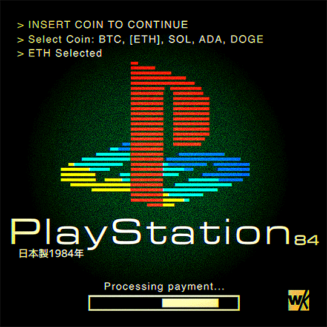

  
  
  <h1>Hola, soy <strong>Jesús Artiaga</strong></h1>
  <h3>💻 Software Developer <em>in Progress</em></h3>

---

Apasionado por la programación, siempre con ganas de aprender, crear y compartir.  
¡Cada línea de código es un paso más hacia el futuro! 🚀

  
  

---

### 👨‍🎓 Sobre mí  
Soy estudiante de Técnico Superior Universitario en Desarrollo de Software en la Universidad Tecnológica de Xicotepec de Juárez. Apasionado por la programación, enfocado en seguir creciendo en backend con Node.js y React Native, mientras amplío mis habilidades en frontend con React, HTML, CSS y más.

---

### 💻 Tecnologías y herramientas  

#### 🖥️ Frontend

#### 🧠 Backend

#### 🗄️ Bases de Datos

#### ⚙️ Herramientas

---

### 🎯 Objetivos  
- Desarrollarme como profesional en backend y ampliar mi experiencia fullstack.  
- Encontrar oportunidades laborales donde pueda aportar y seguir aprendiendo.  

---

  

---

  

    "Aprendiendo a crear, una línea de código a la vez." 💡
  

